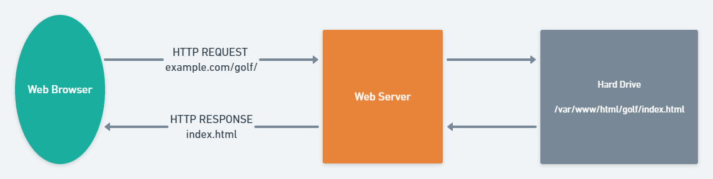
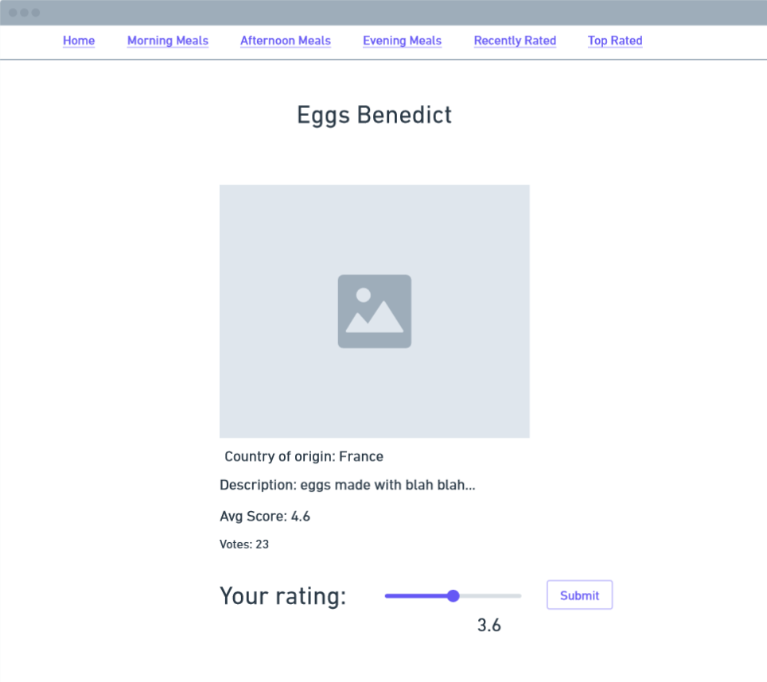
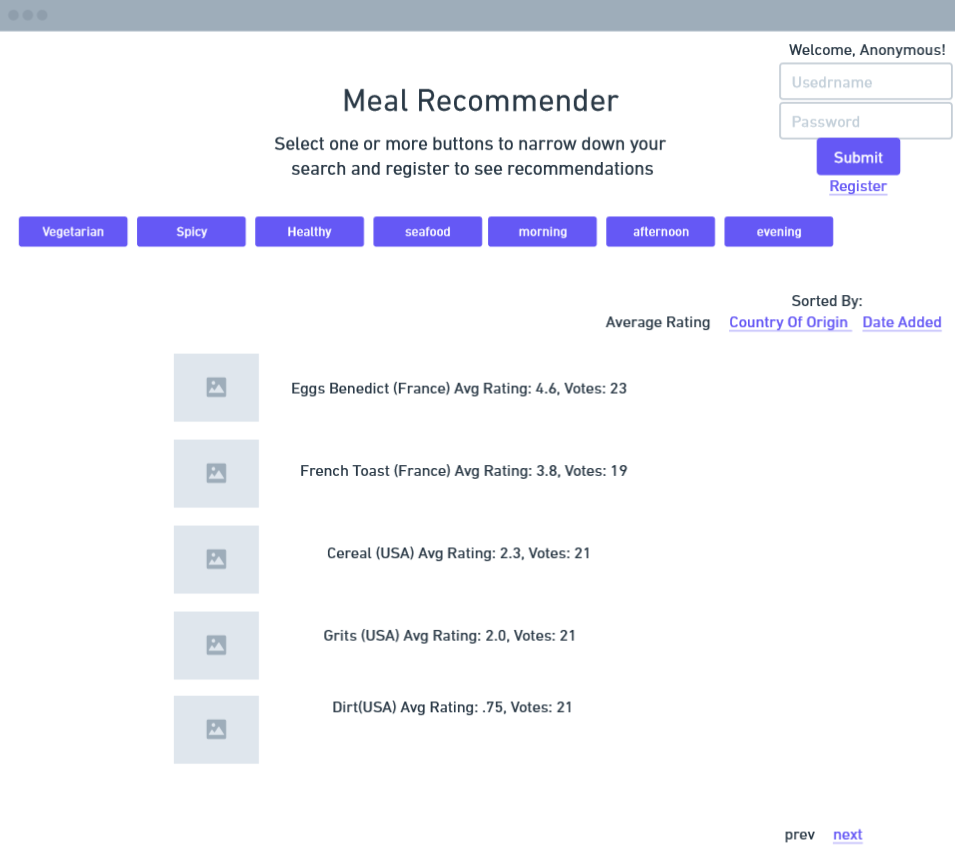
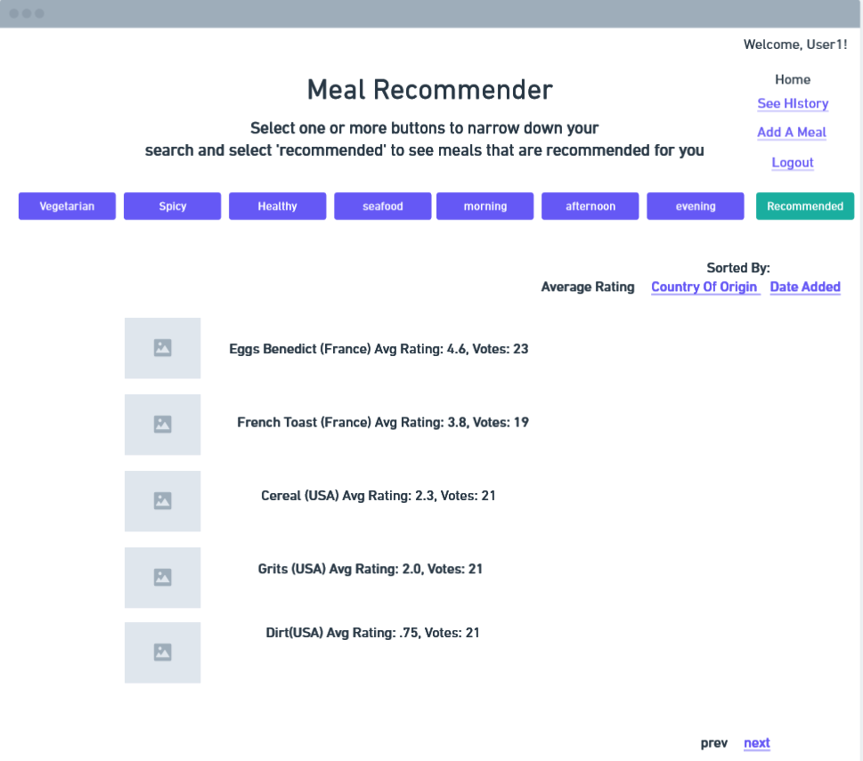
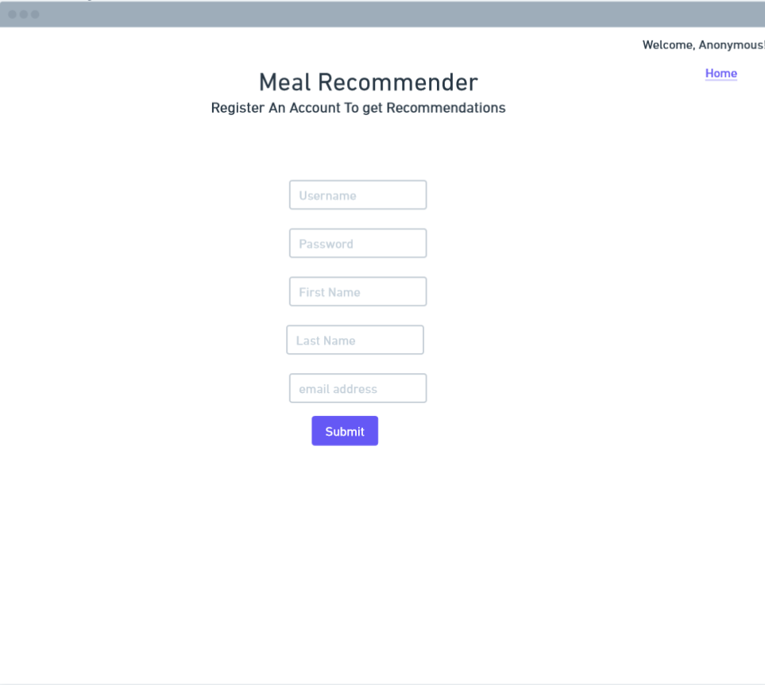
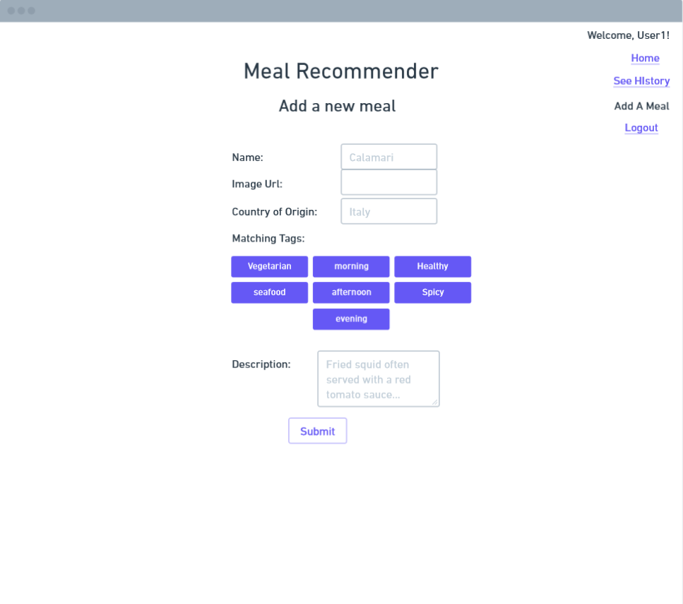
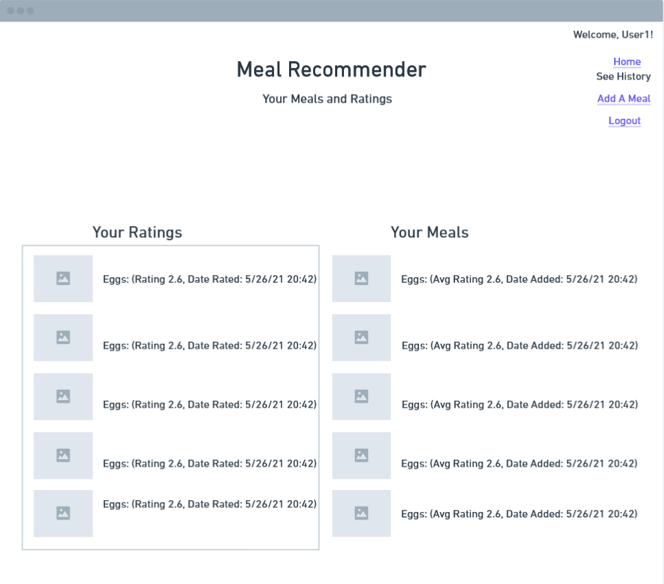
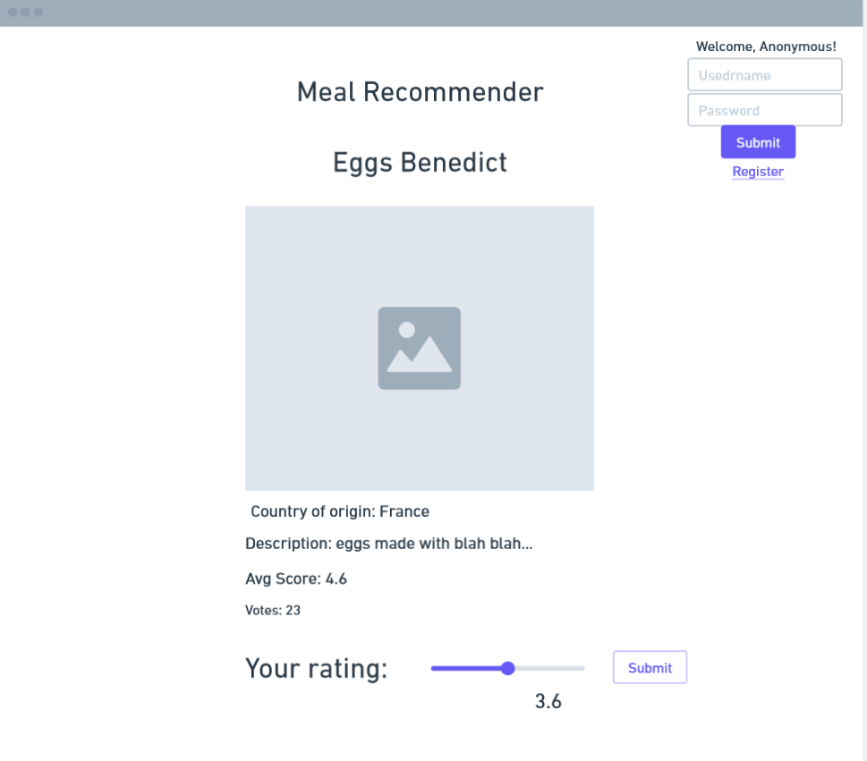
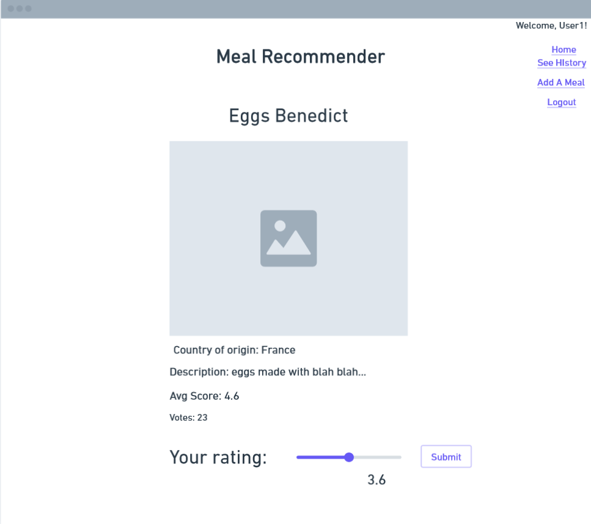

## Django Quickstart
This quickstart output guide will cover all of the necessary knowledge to begin building applications in Django, a Python-based back-end web framework that emphasizes ease of  development but is also powerful enough to be the basis of large projects like Instagram and the Mozilla website. In its most common use-case, Django would be used to create web applications that are driven by Python logic to interact with data from persistent storage (like a database), then insert that data as dynamic content into the web pages that your user sees. However, Django can do much more than that. On top of the ability to pull in any existing Python libraries, Django follows a “batteries included” philosophy and comes packaged with many of the features and functionality that a developer would commonly use in their projects such as testing, authentication, multi-site support and middlewares.

To make the best use of this quickstart, it is suggested you feel comfortable with the following topics:
- Command line activities such as installation, execution with flags
- MVC application architecture
- Python3 Syntax, Python modules
- OOP principles and design
- HTTP protocol 
- Relational database basics
- Getting information from Web API
- HTML, CSS, JS basics

## Django High-Level Overview

Before we begin with installing Django on your system, let’s take a high-level view of Django’s MVT architecture and compare it to the serving of a static web page from a web-server in order to see how all the components of Django fit together. 

Almost every website interaction will involve the basic flow of having a client browser make an HTTP request from a server, requesting some resource, and the server sending back an HTTP response with the contents of the requested resource. In the most basic case, the resource requested is stored on the server computer as one or more static files that may be stored on the hard drive.

You can find a refreshed on general HTTP concepts including Requests and Responses here:
[https://developer.mozilla.org/en-US/docs/Web/HTTP/Overview](https://developer.mozilla.org/en-US/docs/Web/HTTP/Overview)

Django adds a layer to the basic flow, where the Django executable is able to send and retrieve data from a variety of other elements, process it, and assemble a dynamic response that will be understood by the web browser before sending a response. In the end, a Django app receives an HTTP request, and responds with an HTTP response. In this way, we can connect the idea of Django apps to Input->Output.

Let’s look a little deeper through an example. In order to maintain a separation of concerns, Django follows the MVT (Model, View, Template) architectural pattern. MVT is similar to the MVC (Model View Controller) pattern, but if you are familiar with MVC be careful about conflicts in the terminology between the two patterns.

### Model
These are descriptions of the types of data we will use in our application and arguably, serve as the core of our django projects. They are very similar to the concept of OOP classes, containing both data fields and also method definitions. Instances of models can be created and manipulated in code, but they are also represented in the database as records. In this example, we have GolfPlayers, but might also have Skiers, and WebsiteUsers.

### View
These are Python functions and methods that are executed when some url is requested. They take in an Http Request and return an Http Response. They are responsible for all of the business logic that must occur when a resource is requested, as well as the selection and assembly of the components in the final response. In this example, we have views that will be executed when users access the login page, golf page, or skiing page.

### Template
These are skeletons for the types of web pages we want to view as the final output. They are made up of HTML, CSS, and data that was retrieved and inserted by the View. Along with these, Django has a templating language to interact with data passed in as well as help structure the page to do things like create multiple tags in a loop. In this example there is a template for all pages that have to do with sports. We may reuse this template when users request Golf resources or Skiing resources, inserting different content but using the same structure. 

### Putting It All Together

1.  client browser requests ‘example.com/golf’
2.  server passes request on to django
3.  the url mapper matches the ‘/golf’ part of request and calls golfView()
4.  golfView() requests data from the database and uses the GolfPlayer model as a 
        guide
5.  golfView() uses data from the DB and GolfPlayer.calculateStats() from Model 
        definition to calculate statistics for given players
6.  golfView() inserts DB data and calculated data into sports template 
7.  golfView() returns assembled template with inserted dynamic data
8.  Django passes response back to server
9.  Server passes response back to client browser

Of course, this is an example showing a fraction of the potential of Django in order to illustrate the overall flow.

## Installation and Setup
Django is written in Python and installed as a python package through the pip python package manager. If your particular operating system supports Python, you will more than likely be able to install Django as well.

1. Install Python if it is not already installed. 
    - check which version of Python is needed for the newest version of Django:
    -  https://docs.djangoproject.com/en/3.2/faq/install/#faq-python-version-support
    - Official Beginner’s Guide for Python: 
    -  https://wiki.python.org/moin/BeginnersGuide/Download
    - make sure to click “add Python to PATH” during installation
    - Test your installation by running the python executable with no arguments. exit interactive mode with `quit()` 
    - because the python executable has different names in different operating systems, 
    it will be referred to by the name ‘python’ for the rest of this quickstart. 
2. Install Django pip package
    -  https://docs.djangoproject.com/en/3.2/intro/install/
    - `pip install django`
3. Start a test project 
    - `django-admin startproject testProject`
    - this should generate a folder containing a number of files
    - 
4. Run your test project on the development server
    - change directory to the testProject directory
    - `python manage.py runserver 8080`
    - open your web browser and enter this address: “127.0.0.1:8080”
    - you should see this:
    - 
5. (optional) Create virtual environments to isolate each Django project
    - Windows: https://docs.djangoproject.com/en/3.2/howto/windows/#setting-up-a-virtual-environment  
    - Linux/MacOS(see section on venv): https://docs.djangoproject.com/en/3.2/intro/contributing/ 
7. (Optional) Install django-extensions pip package
    - this package includes some quality of life features like auto-loading all packages when 
        testing instead of loading them in manually
    - `pip install django-extensions`

## Official Tutorial: Poll Project
Follow the Django official tutorial to get an understanding of how all of the components work together:
https://docs.djangoproject.com/en/3.2/intro/tutorial01/

## Stepping Stone 1: Url Dispatcher, Views, Templates
The Django request cycle is:

1. Client Browser makes Http Request
2. Url Dispatcher matches the requested url, and calls associated view function
3. View function assembles an Http Response
4. Http Response is sent back to Client Browser

The url dispatcher is the first routine of our django app that is triggered by an incoming request and the url->view mappings are stored in one or more `urls.py` files within the `urlpatterns` list.

https://docs.djangoproject.com/en/3.2/ref/urls/

The next step in the sequence is to call the view functions that are defined in any django applications’s `views.py` file. View functions will do one of the following: redirect the request, raise an exception, or assemble and return an HttpResponse object. 

https://docs.djangoproject.com/en/3.2/topics/http/views/

You can learn about HttpResponse and HttpRequest objects including determining the Http Request method (GET, POST..) and accessing data posted from forms here:

https://docs.djangoproject.com/en/3.2/ref/request-response/

Views are used in conjunction with templates. As a view is assembling the HttpResponse, it needs a way to dynamically generate the HTML of the response. Templates are composed of static HTML and django-template syntax for inserting data from the view and basic flow-control abilities (FOREACH, IF) related to the construction of the HTML. They can be extended and reused and can be made to generate other formats like XML and CSV as well. 

https://docs.djangoproject.com/en/3.2/ref/templates/language/

## Challenge 1A: Sports/Game Fan Website
Your first project involves the creation of a website about your favorite sport (or video game if you like) meant to inform the audience about relevant details of the sport. It will rely on templates in order to give structure to the HttpResponses, and pre-written data from views that is passed into templates.

Your project will contain one Django application that has its own `urls.py` and `views.py`. 

Your website will have 5 types of pages, and for each you will need to add an entry into the Url Dispatcher, write a view function, and create an appropriate template that uses reverse url resolution for internal urls.
https://docs.djangoproject.com/en/3.2/topics/http/urls/#reverse-resolution-of-urls

#### ‘’->views.index
- _description:_
    - landing page
- _view:_
    - includes hard-coded list of strings of urls of images of scenes from the sport
    - randomly selects one of url strings from list and passes it into template 
- _template:_ 
    - includes named blocks “header” and “footer” from base.html
    - includes content describing purpose of page and image tag with random url from view

#### ‘rules/’->views.rules
- _description:_
    - page giving rules or description of sport
- _view:_
    - simply render template 
- _template:_ 
    - includes named blocks “header” and “footer” from base.html
    - includes content describing rules or description of sport

#### ‘notables/\<int:notablesIndex\>/’->views.notablesDetail
- _description:_
    - detailed view of a notable player or character including name, image, description, and stats
- _view:_
    - includes hard-coded list of dictionary elements representing players or characters (at least 3)
    - a single list element will be selected and passed to template
    - each dictionary element should have string values for name, imageUrl, description, and a list for stats
    - uses `notablesIndex` value from `path()` to access appropriate list element
    - should raise Http404(“player does not exist”) on IndexError exception https://docs.djangoproject.com/en/3.2/intro/tutorial03/#raising-a-404-error
- _template:_ 
    - includes named blocks “header” and “footer” from base.html
    - image tag and relevant information of selected player
    - link back to list of notables

#### ‘notables/’->views.notablesList
- _description:_
    - list of internal links to each of the notable players
- _view:_
    - simply pass the list of players into template 
- _template:_ 
    - generate anchor tags for each player, using thumbnail of their image and 
      their name as the content of html tag using `for` django-template tag
      https://docs.djangoproject.com/en/3.2/ref/templates/builtins/#std:templatetag-for
    - anchor tags link to detailed view of player

#### ‘externalLinks/’->views.externalLinks
- _description:_
    - set of external links to learn more information about your sport / game
- _view:_
    - contains list of string urls to off-site resources
    -  passes list of urls to template
- _template:_ 
    - includes named blocks “header” and “footer” from base.html
    - iterates through each url and generates anchor tag for each

Finally create the base template `base.html` in the appropriate directory that will be extended for each of the pages in your site. It will contain the following named blocks:
- "header": has navbar with anchor tags to each of the pages within the site besides the detailed view of notable players
- "footer": has copyright information, year, webmaster email address

## Challenge 1B: Car Information Portal
Your employer runs a car warehouse that specializes in some subset of car makes (EX: "German Cars": Audi, BMW, Mercedes... OR  EX: "Sports Cars": Ferrari, McLaren, Bugatti...) They need to a user-friendly website for requesting and displaying information from the external API located at 

https://vpic.nhtsa.dot.gov/api/

JSON data must be retrieved and parsed from the API in order to display the results within a webpage. 
This is a good opportunity to incorporate python libraries into your django project. Python has a with a library for opening external URLs:

https://docs.python.org/3/library/urllib.request.html

But it is highly recommended to install and use the 'requests' library instead:

https://docs.python-requests.org/en/master/

You will most likely want to convert JSON data into a python dictionary. You use python's json library for that:

https://docs.python.org/3/library/json.html

Once you have installed the library and created a single-app Django project, use Django's shell to explore how to make these requests within the context of your Django program using  `python manage.py shell`.

Besides the data from the API, your employer wants the site to serve a lot of the media and scripts directly from the server. Determine the set of car makes you wish to use and find images of their logos to be used as static resources on your page. Any javascript files you create should be included as well. 

https://docs.djangoproject.com/en/3.2/howto/static-files/

The user will interact with the site primarily through forms. We will go more in depth into forms in later stepping stones but for now you can make some basic forms. You can refresh your memory on creating forms in Django here:

https://docs.djangoproject.com/en/3.2/ref/forms/

This Django project will feel like a single-page app and will reuse a header on all pages that has these elements:

- MAKE: dropdown menu with options populated by the set of car makes you decided to use and defaults to the first choice from the set
- MODEL: dropdown menu with options populated by API call if a car make has been selected and submitted. it also includes an 'any' option which is default if no make is selected. You may also load these choices asynchronously using AJAX
https://developer.mozilla.org/en-US/docs/Web/Guide/AJAX/Getting_Started
- BEG DATE: input type number that has minimum of 1886, maximum of the current year and defaults to current year. can set this using HTML parameters for now
- END DATE: input type number that has minimum of 1886, maximum of the current year and defaults to current year. can set this using HTML parameters for now
- SUBMIT: button or anchor to submit form data

The project will have 3 types of pages: 

#### ‘’->views.index
- HTTP GET
    - header with default search values
    - display available makes including images of logos of each and links that lead to modelList/\<make\>/ of each make for current year to current year
    - 
- HTTP POST
    - header must maintain search values that were submitted
    - list items for all matching entries with at least 4 values (EX: year, model, engine power, top speed) from API entry
    List of available variables per entry: 
    https://vpic.nhtsa.dot.gov/api//vehicles/GetVehicleVariableList?format=json
    - view raises http404 if no matches
    - 
#### 'modelList/\<make\>/'-> views.modelList
- search parameters in header should be set to make: given, model: any, beg date: current year, end date: current year
- main content contains list of all models for the current year of the given make
- each model in list should be clickable and send user to search results page with parameters make: given, model: given, beg year: minimum, end year: maximum
- should raise http404 if user enters url with make that is not in set of makes your employer chose
- 
    

## Stepping Stone 2: Models, Migrations, Generating Data, Querysets
Django can use a wide range of choices for your persistent and ephemeral backend storage. Generally all that is required to hook your Django project up to storage is a few modifications of your project's `settings.py` file. You can choose from any of the available options but this quickstart will follow a MySQL route. 

### Installing database software
- “MySQL Community Edition” is the free version
- https://dev.mysql.com/downloads/
- you can skip any registration
- you can choose the ‘developer default’ installation options
- if you want to save space, do custom install and select the server, the shell, the python connector, the java connector
### Install Python DB API driver for mysql 
- if you did not install Oracle's MySQL server, you may need to also install mysqlclient
- https://pypi.org/project/mysqlclient/
### Install MySQL database explorer
- this will be useful for us to examine our data directly
- The suggested choice that is user-friendly is DBeaver: https://dbeaver.io/
- alternatively you can use the command-line client https://dev.mysql.com/doc/refman/8.0/en/mysql.html
### Create New Named database for your Django Project Through Database Explorer
- Dbeaver: right click 'databases', click 'new' 
- command-line client: https://docs.djangoproject.com/en/3.2/ref/databases/#creating-your-database
### Connect a new Django project to running database
- https://docs.djangoproject.com/en/3.2/ref/databases/#connecting-to-the-database
- if you are using python connector from Oracle's MySQL installation: 
- https://dev.mysql.com/doc/connector-python/en/connector-python-django-backend.html

### Models 
Models are one of the most powerful features in Django, giving developers an API for interacting programmatically with stored data regardless of the way it is stored. They are the "definitive source of information about your data" and each model defined in `models.py` files is used to derive DB schema, relationships between types of data, and  behavior. 

https://docs.djangoproject.com/en/3.2/topics/db/models/

### Migrations
Migrations are version control for DB schema that ease testing and incremental design. Any time you make modifications to your models, you should generate a new migration using `python manage.py makemigrations`. After that you can roll back or forward your database's schema using migrations using `python manage.py migrate` with various command line options. 

https://docs.djangoproject.com/en/3.2/topics/migrations/

### Generating Data
It is useful to have a way to programatically create instances of models as you design, plan, and test them and the relationships between them. Django provides 'fixtures' as a static way to generate data and populate your database. You can also write your own scripts and use "factories" to generate data more dynamically. You will use fixtures and a factory library called Factory Boy in this stepping stone.

https://docs.djangoproject.com/en/3.2/howto/initial-data/
https://factoryboy.readthedocs.io/en/stable/introduction.html
https://pypi.org/project/factory-boy/

### Querysets
Querysets give a powerful API for requesting records from the DB and can stored and modified themselves without touching the database. 

https://docs.djangoproject.com/en/3.2/ref/models/querysets/

## Challenge 2A: Meal Ratings Site
In this project you will create a website that allows users to vote on their favorite meals. Anonymous users will be able to navigate through available meals, sort the listings in a variety of ways, and to upload their own meals. 

In order to represent and store the data for your site you will need to create a Meal and MealRating model. 

| Meal |
| :----: |
| - name : string |
| - description : string | 
| - imageUrl : string | 
| - countryOfOrigin : string | 
| - typicalMealTime: int (1: morning, 2: afternoon, 3: evening) | 
| - dateAdded: datetime (default: current time) | 
| - avgRating() : float (0 if no ratings have been submitted) | 
| - numberOfVotes() : int | 

| MealRating |
| :--------------------:  |
| - meal : MealForeignKey |
| - rating : float  (min 0.0 max 5.0) |      
| - dateOfRating : datetime (default: current time) |

Notice there are some restrictions on the data for some of the fields. There are a variety of ways to enforce this, including HTML parameters, so you may select your preferred method for now. Proper validation using Django validators will be discussed later in the quickstart. 

We have provided a fixture to seed the initial data for 18 meals and some meal ratings here:

And some images to go along with the 18 initial Meals. Take note of the relationship between the image name and the primary key of the Meal:

# ####################################MAKE SURE TO TEST IMAGES AND FIXTURE BEFORE DEPLOYING####################################################################################################

The site should have the following types of pages:

### Landing Page
- should have links to each category's categoryList page and 3 images of meals from that category
    - morning
    - afternoon
    - evening
    - recently added (>= 90 days before current date)
    - top rated foods (>= 4.5 rating)
- has form on page that allows users to submit a new meal using current date and time for dateAdded field of model then sends user back to landing page

### Category List Page
- includes header with links to landing page and category list for each category
- displays anchor tag'd image and basic information about all meals that fall under given category
- include name, avgScore, and number of votes
- anchor tag leads to detail view for that particular meal
- anchor tags in top right corner should allow users to sort the Meals from that category in the following ways:
    - most recently added meals
    - highest rated meals 
    - alphabetically by country of origin name
 

### Meal Detail View
- includes header with links to landing page and category list for each category
- displays large picture of meal along with all data from mode fields
- includes slider and submit button to submit a rating for that meal (setting dateOfRating to current date and time) then sends user back to detail view
- raise 404 if no meal at that URL

## Challenge 2B: Meal Recommender Site
As is common in the workplace, your next project project involves taking an existing project and modifying/extending it. 
Your Meal Ratings site was successful and you have been tasked with adding some new features. 

### Users and Authentication
Anonymous users can still use your site but your site should now allow users to create accounts and have ratings they have made persist through logins using Django's built-in
authentication system. Anonymous users may not add new meals but MealRating votes from anonymous users should still be persisted and count towards a Meal's number of votes and avgRating(). 

https://docs.djangoproject.com/en/3.2/topics/auth/

You may use Django's provided authentication views or write your own in order to handle user registration, logging in, logging out.  

https://docs.djangoproject.com/en/3.2/topics/auth/default/#module-django.contrib.auth.views

Django does not provide any authentication templates to use, but if you do use the provided authentication views, here is a list of all context variables that are passed in from the view:
https://docs.djangoproject.com/en/3.2/topics/auth/default/#all-authentication-views

### Models
In terms of models, you will use the models from the previous project with some adjustments and add some new models as well. Using Django's auth system will add the User model to your project.
https://docs.djangoproject.com/en/3.2/topics/auth/default/#user-objects

The Meal model will have the typicalMealTime field removed. Any meal will now be associated with 0 or more tags that will allow users to narrow down their search from the following set: {vegetarian, spicy, healthy, seafood, morning, afternoon, evening}. For example, a user may now list all Meals that are associated with the "spicy", "afternoon", and "breakfast" tags. This should implemented by creating a new Tag model and using many-to-many relationships. 

https://docs.djangoproject.com/en/3.2/topics/db/models/#many-to-many-relationships

Registered users will have the ability to see which meals and ratings they have submitted. 

### Generating Data
In order to plan, build, and test proper ORM relationships between your models, you will need to create realistic data to populate your database. In the last project you used provided data from a Django fixture, but that is a largely static solution. In this project you will generate your own instances of Meal, MealRating, User, and Tag data by writing a Python script that uses the Factory Boy and Faker libraries.  

For some model fields, it is sufficient to use Python's random module to generate random numeric values. For your User model you will need to generate test data that is non-numeric. The faker library is included with factory boy and is a great source of realistic usernames, email addresses, etc. You can learn more about the faker library here: 

https://faker.readthedocs.io/en/master/fakerclass.html

### Recommendation Function
Registered users have the added functionality of getting meal recommendations. When listing meals that match tags, they can also select an option to further narrow down and or sort meals that are recommended for them based off of the ratings of users with similar submitted ratings. For example, registered users can select "Evening", "Vegetarian", "Recommended", to see meals that match the tags and liked by similar users.  

### Types of Pages

#### Landing page(registered user or anonymous user)
- List meals based on buttons that can be selected or unselected from the set of Tags {vegetarian, spicy, healthy, seafood, morning, afternoon, evening}. 
- when selecting any Tag button, reload meals listed to reflect new subset of mealsd and maintain state of all previously toggled buttons
- If no meals match the toggles then inform the user that there are no matches.
- for each meal listed, include a thumbnail of the image, the name, the country of origin, the average rating, and the number of ratings. 
- clicking a meal should take the user to that meal's detail page.
- links allow user to sort listed meals by average rating, date added, or country of origin with default being date added. 
- ensure there is some way to iterate through all meals that match   
- Anonymous User
    - indication that current user is anonymous
    - small form to sign in with fields for username, password, and submit button
    - link to registration page
    - 
- Registered User
    - indication in header that current user is signed in along with their username
    - includes links to landing page, user's history page, user's add a meal page, and logout
    - 
 
#### Logout (only registered users)
- log out user
- return to landing page as anonymous

#### Registration Page(only anonymous users)
- indication that current user is anonymous
- link to landing page
- form with fields for: first name, last name, email, username, password
- submit button that sends user to landing page
- 

#### Add Meal Page (only registered users)
- indication in header that current user is signed in along with their username
- includes links to landing page, user's history page, user's add a meal page, and logout
- includes form fields for Meal model fields 
- includes toggle buttons to select which tags meals should be associated with from {vegetarian, spicy, healthy, seafood, morning, afternoon, evening}
- on submit, associate current user with meal added and set date to current date and send user back to landing page
- 

#### See History Page (only registered users)
- indication in header that current user is signed in along with their username
- includes links to landing page, user's history page, user's add a meal page, and logout
- displays list of all meals added by logged in user (image, name, avgRating, votes, dateAdded) sorted by date added that each link to detailed view for meal
- displays list of all meals voted on by logged in user (image, name, avgRating, votes, dateRated) sorted by date rated that link to detailed view for meal
- 

#### Meal Detail Page(registered user or anonymous user)
- displays large picture of meal along with all data from model fields
- includes slider and submit button to submit a rating for that meal (setting dateOfRating to current date and time) then sends user back to detail view for same meal.
- values for rating must be between 0.0 and 5.0
- raise 404 if no meal at that URL
- Anonymous User:
    - indication in header that user is anonymous
    - includes same simple login form from landing page
    - includes link to landing page and registration page
    - on submit, meal rating  is not associated with any user 
    - 
- Registered User: 
    - indication in header that current user is signed in along with their username
    - includes links to landing page, user's history page, user's add a meal page, and logout
    - rating submission associated with currently logged in user
    - 
        

# Stepping Stone 3: Forms API, Validation, Middleware, Security

### FORMS/VALIDATION
- https://docs.djangoproject.com/en/3.2/ref/forms/api/#using-forms-to-validate-data
- https://docs.djangoproject.com/en/3.2/topics/forms/modelforms/
- https://docs.djangoproject.com/en/3.2/ref/validators/

### MIDDLEWARE
- https://docs.djangoproject.com/en/3.2/ref/middleware/
- https://docs.djangoproject.com/en/3.2/topics/http/sessions/

### SECURITY
- https://docs.djangoproject.com/en/3.2/topics/security/#sql-injection-protection
- https://docs.djangoproject.com/en/3.2/topics/security/#cross-site-request-forgery-csrf-protection
- https://docs.djangoproject.com/en/3.2/topics/security/#referrer-policy
- https://docs.djangoproject.com/en/3.2/topics/security/#user-uploaded-content

# Stepping Stone 4: Drivers, Queues/Workers, CDN, EMAIL

### DRIVERS
- https://docs.djangoproject.com/en/3.2/topics/http/file-uploads/
- https://channels.readthedocs.io/en/stable/introduction.html
- https://medium.com/@ksarthak4ever/django-websockets-and-channels-85b7d5e59dda
- https://www.youtube.com/watch?v=8hxr3T5cUbo&t=1510s 

### ASYNCHRONOUS WORKERS
- https://docs.djangoproject.com/en/3.2/howto/deployment/wsgi/uwsgi/
- https://medium.com/@bencleary/django-scheduled-tasks-queues-part-1-62d6b6dc24f8
- https://gunicorn.org/
- https://docs.gunicorn.org/en/latest/design.html
- https://docs.celeryproject.org/en/stable/django/index.html

### CDN
- https://docs.djangoproject.com/en/3.2/howto/static-files/deployment/#serving-static-files-from-a-cloud-service-or-cdn

### EMAIL
- https://docs.djangoproject.com/en/3.2/topics/email/

# Incremental Multi-App Project for Remaining Stepping Stones: CodeBowl
Turn-based, tile-based game with RPG elements based loosely around soccer but with ability to knock players out. Based on classic board game: Blood Bowl. 
- teams of 7vs7 spread out on 20x20 grid
- goal is to get ball into opponent's goal or kill all opponent team members
- users can log in and persist their data (including team and win stats)
- users can compete in 1v1 matches with a live chat client 

### Mapping of CodeBowl elements to quick start stepping stone concepts
- SS3(Forms API, Validation) 
    - registration page
        - username, first name, last name (char limit)
        - password (requires special characters? MUST WRITE OWN VALIDATOR)
        - email(real email?)
    - team creation page 
        - player stats must add to 12 (from set: strong, agile, balanced)
        - name (char limit)
        - image upload (size, filetype, filename) 
- SS3(Middleware, Security) -> sessions 
    - auto-login middleware for registered users using sessions
    - remember CSS 'theme' ?
    - preload user's images (team image, player images)
    - SQL-injection prevention for all text fields
    - CSRF tokens for all forms
    - restrictions on user-uploaded content
- SS4 (Drivers, Workers...)
    - synchronous chatroom on landing page to organize games using websockets
        - https://www.youtube.com/watch?v=8hxr3T5cUbo&t=1510s 
        - chatroom for 2 players in middle of game also
    - queue for handling multiple actions on a turn that might arrive
    - email system for forgotten password
    - use amazon s3 for CDN for images?
  
### Models
- User
   - String: first name
   - String: last name
   - String: email
   - String: username
   - String: password
   - Team team
- Team
   - String: name
   - Image: image 
   - Player[] players
- Player
   - String: name
   - String: image
   - int: strength
   - int: agility
   - int : movement 
   - bool: isKnockedDown
   - bool: isDead
- Game
   - Tiles[][] grid
   - int round
   - Team team1
   - Team team2
   - int team1Score
   - int team2Score
   - User CurrentUser
- Tile
 - ?Player player
 - boolean: hasBall
    
### User Interaction Flows
- login  -> control panel -> manage team -> restart team -> control panel
                          \-> search for game -> game start -> control panel
- register -> create team -> control panel

### Game Flow
1. players for each team are spread out in preset way on either side (maybe add user placement eventually). 
2. coin toss occurs to see which team 'attacks' first
3. attacking team has ball put on random square on their side
4. attacking team players each perform an action (move or attack) until they get knocked down, drop the ball, use all turns, score a point, or end turn early with button
5. defending team players each perform an action (move or attack) until they get knocked down, or use all turns, have point scored by enemy team, or end turn early with button
6. game play continues until round limit (10) is reached with 1 turn for each team per round, or all players of a team are dead
7. winner is team with higher score when game ends

### Team Creation
- pick name
- upload team image
- create 7 players
    - upload image
    - pick name
    - distribute 12 points among 3 stats: Strength, Agility, Movement 

### Movement Mechanics
- user may select any of their players that has not finished movement/action to move
- movement begins with a left click of a friendly player to select it then left clicks on squares you wish to move within the movement allowance, then end with a click of submit
- right click cancels movement if not submitted and refreshes squares selected
- if you move OUT OF a square that is adjacent to an enemy you have a chance to get knocked down
    - if players have equal agility: (60% safe, 40% knocked down) 
    - for each point higher in agility +10% safe, -10% knocked down)
    - for each point lower in agilty than target -10% safe, +10% knocked down 

### Combat Mechanics
- a player may only attack adjacent enemies
- if players have equal strength: (50% knock opponent down, 25% no effect, 25% self gets knocked down)
- for each net point advantage, +10% knock down opponent, -5% no effect, -5% self gets knocked down)
- if multiple allies are adjacent to target enemy, chances for successful knockdown go up 
    - add 1 net point advantage for every ally with equal strength to target
    - add 2 net point advantage for every ally with higher strength to target 
    - add .5 net advantage for every ally with lower strength than target (final net advantage points are math.floor()'d)
- upon successful knockdown, rolls for death. target has 10% chance to die. dead players leave the game but return next game. 

### Ball Mechanics
- picking up a ball is based on agility. 3 agility gives 60% chance with. for each point of agility higher than 3, add +10% chance. for each point lower than 3 -10% chance. 
- if player holding ball is knocked down, ball scatters randomly within 3x3 grid
- if player attempts to pick ball up and fails, ball scatters randomly 1 adjacent square
