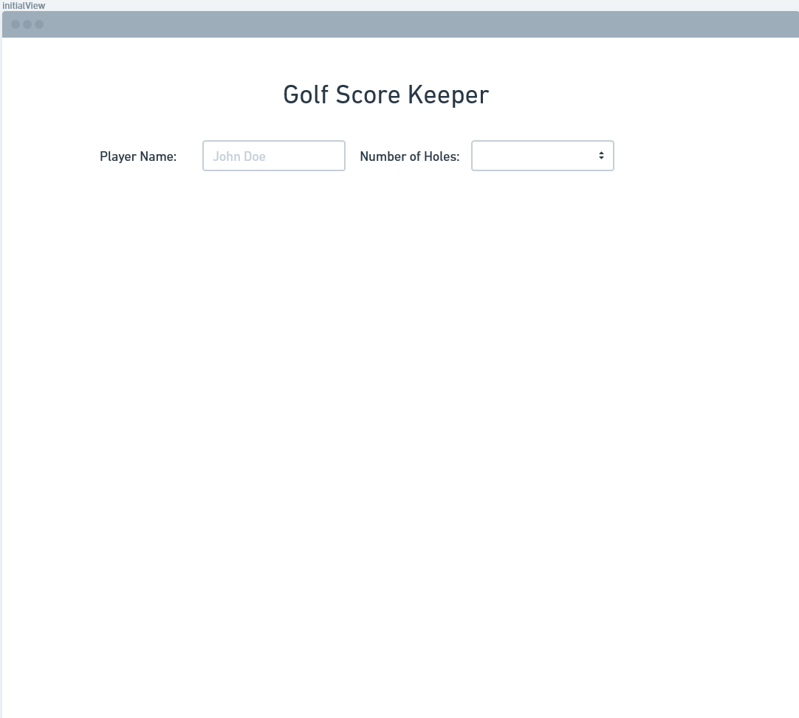
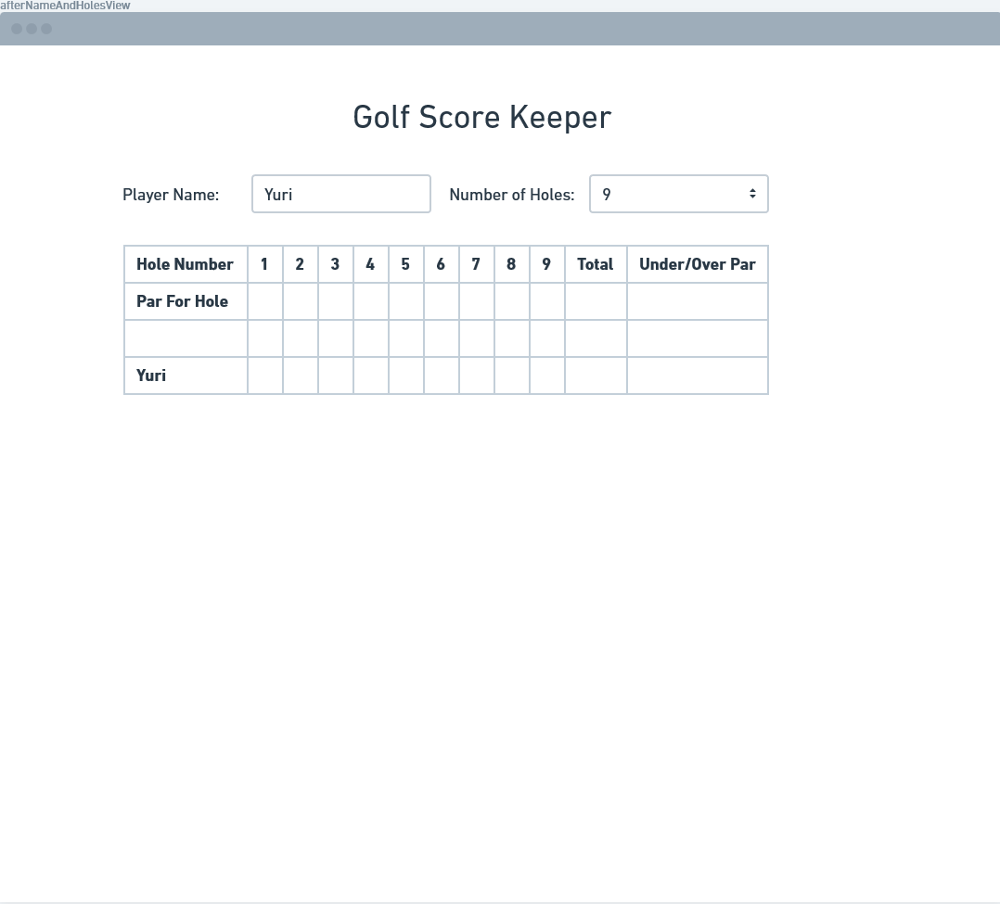
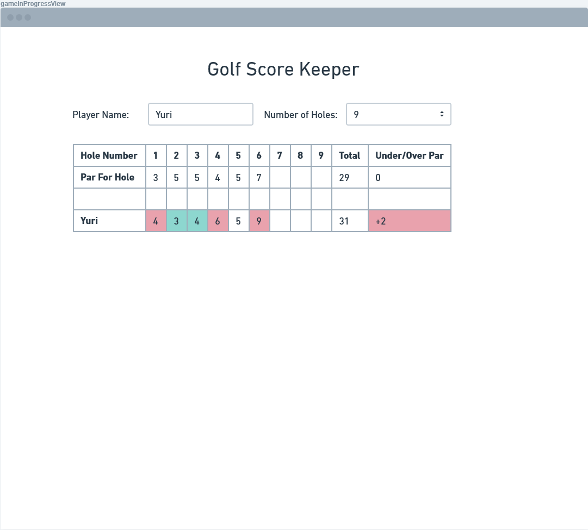
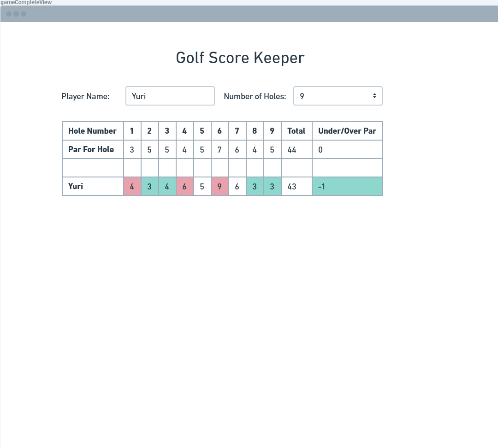

# Angular Quickstart
This quickstart will cover all the necessary knowledge to build web applications in [Angular](https://angular.io/) by guiding you through official documentation and incremental output steps. 

#### What is Angular?
- Angular is a sophisticated front-end design and development framework backed by Google with an emphasis on creating single-page apps
- The core goal for the Angular framework is to take static HTML and CSS pages and make them dynamic by combining them with javascript into packages called 'components'. Components can be composed to make applications
- Development in Angular is done in Typescript, a statically-typed superset of Javascript, then is transpiled to Javascript
- Ultimately, the product of Angular is HTML, CSS, and Javascript that is run on a web browser
- Angular has many features to support design, development, and testing, and is built from the ground up with dependency injection in mind 
- Angular is a non-compatible rewrite of the older framework 'Angular.js' which is being phased out

#### What You Will Need To Know For This Quickstart
- How to execute and run programs from a CLI
- HTML, CSS, Javascript fundamentals
- Object oriented design principles
- [Typescript](https://www.typescriptlang.org/) fundamentals (if you are comfortable with Javascript you will only need a short review to begin using Typescript)

#### Installation 
You have two options for setting up a development environment for running Angular programs. This quickstart will use the local CLI option, but you could easily follow along with either option. 
- [Web Based](https://stackblitz.com/fork/angular-ivy)
- [Local](https://angular.io/guide/setup-local)

#### Angular Element Hierarchy
**Application**: all angular files for project. composed of modules. always includes at least _root module_
- [Modules](https://angular.io/guide/architecture-modules): cohesive block of code towards some purpose. can import data or export data to other modules. composed of components, services providers, and other related code.
    - [Components](https://angular.io/guide/architecture-components): HTML, CSS, and TS that define a visible patch of website called a 'view'  
    - [Service Providers](https://angular.io/guide/architecture-services): A class with a well defined purpose that is not directly associated with a visible part of the application.

#### Angular File Hierarchy ####FOR SHINYA: TURN THIS INTO A PICTURE / DIAGRAM
**Application**: `/rootDir/` 
- Modules: `/rootDir/src/app/<moduleName>.module.ts`
    - Components: `/rootDir/src/app/<componentName>/`
        - `/rootDir/src/app/<componentName>/<componentName>.component.ts` 
        - `/rootDir/src/app/<componentName>/<componentName>.component.html`
        - `/rootDir/src/app/<componentName>/<componentName>.component.css`
        - other files to support this component, like interfaces/class definitions
    - Services: `/rootDir/src/app/<serviceName>.service.ts`

#### Official Tutorial
Before continuing this quickstart, run through the [official tutorial](https://angular.io/tutorial) to get an initial understanding of Angular. 

# Stepping Stone 1: Components / Basic Templates / Basic Binding
The first stepping stone will focus on the building block of Angular apps: components make sure to read up on the concept of components [here](https://angular.io/guide/component-overview), and the architectural reference [here](https://angular.io/guide/architecture-components). 

Components are composed of templates, css files, and at least one typescript file that defines the component class. After creating a component using the command-line options, take note of the decorator above the component's class definition in the typescript file. This will map the component to each of its files. 

Each component defines a 'view' which is a portion of visible website. While the typescript file performs processing and is a source of dynamic data, this data can be inserted into your html through [templates](https://angular.io/guide/template-syntax) through various types of binding such as interpolation, or two-way binding. 

# Project 1A: Golf Score Keeper
In this first project you will create a dynamic score-keeping application for a game of golf that updates as data is entered into it. 

Golf is played over a series of 'holes' where the player attempts to hit the ball into a hole with the fewest amount of swings or 'strokes'. The number of strokes for each hole is recorded and added up for the final total. At each hole, a sign is typically posted that shows how many strokes a skilled golfer typically requires for that hole. This is a way to give a benchmark to players on a per-hole basis and a course-wide basis. A golfer who took 6 stokes on a 'par 4' hole would be considered 'two over par'. Also, a golfer that took 66 strokes across all holes compared to a par 70 course would be 'six under par' and would be considered very competent

Your single-page application should be made with at least 2 components and can be thought of as having 4 states: 

1. initial state(when page first loads): 
    - heading with a title like "golf score keeper"
    - text input field for player's name
    - dropdown or number input for number of holes in the course

2. scoring grid state(only visible when both name and number of holes have been set by input elements)
    - keep all elements from initial state
    - should generate a grid enough columns for number of holes selected, as well as 'total' and 'under/over par' 
    - generate one row for 'par'. users can enter the par for each hole. total will be dynamically updated. 'under/over par' is always 0
    - player's name in grid and input field should be able to be updated through [two-way binding](https://angular.io/guide/two-way-binding)
    - generate one row for the player. users can enter their strokes for each hole. total and 'under/over par' will be dynamically updated

3. game in progress state
    - as game progresses, user continues entering the par for each hole and their number of strokes per hole. 
    - for each number of strokes, if it is above par, that cell background should be red. if it is under par it should be green. if it is par it should be neutral. 
    - the par and player 'total and under/over par' columns should be dynamically updated. player's total follows same color scheme to individual strokes compared to overall par. 

4. game completed state
    - no more cells left to enter data. User quickly closes application if their total is red or shows it to opponent if their total is green. 

As an extra challenge, try adding more players whose scores can be tracked. 

# Project 2B: Cafe Menu 
- (data model idea) menu item interface
    - string: itemName
    - number: itemPrice
    - string: itemImageUrl
    - string: customerName
- can select different items to display just 1 at a time

- uses hierarchical quality of components
- can select multiple Coffeeshop Menu Items to create an Order
- displays all menuItems, total price, customer name
- can store multiple orders, expand/collapse view of orders, 'finish' to remove orders

# Stepping Stone 2: Binding

# Stepping Stone 3: Services and Routes
    - queue
        - add messages to queue on events
    - application wide service
    - application wide and fetching from external source
