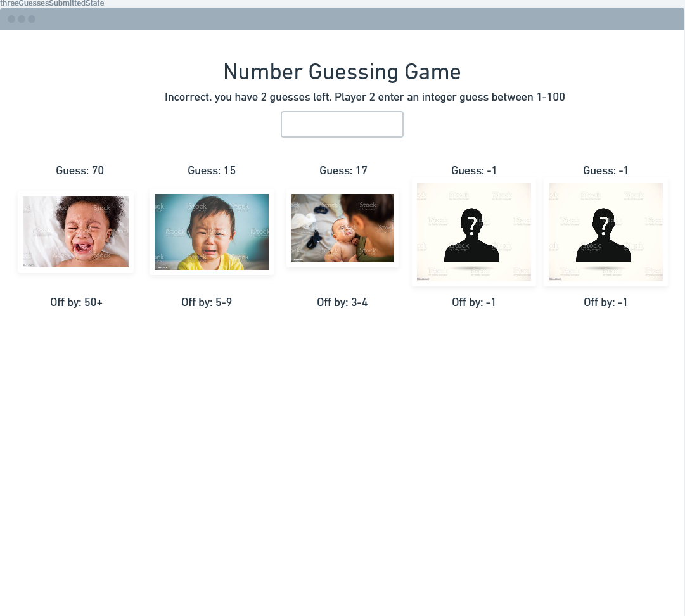

# Angular Quickstart
This quickstart will cover all the necessary knowledge to build web applications in [Angular](https://angular.io/) by guiding you through official documentation and incremental output steps. 

#### What is Angular?
- Angular is a sophisticated front-end design and development framework backed by Google with an emphasis on creating single-page apps
- The core goal for the Angular framework is to take static HTML and CSS pages and make them dynamic by combining them with javascript into packages called 'components'. Components can be composed to make applications
- Development in Angular is done in Typescript, a statically-typed superset of Javascript, then is transpiled to Javascript
- Ultimately, the product of Angular is HTML, CSS, and Javascript that is run on a web browser
- Angular has many features to support design, development, and testing, and is built from the ground up with dependency injection in mind 
- Angular is a non-compatible rewrite of the older framework 'Angular.js' which is being phased out

#### What You Will Need To Know For This Quickstart
- How to execute and run programs from a CLI
- HTML, CSS, Javascript fundamentals
- Object oriented design principles
- [Typescript](https://www.typescriptlang.org/) fundamentals (if you are comfortable with Javascript you will only need a short review to begin using Typescript)

#### Installation 
You have two options for setting up a development environment for running Angular programs. This quickstart will use the local CLI option, but you could easily follow along with either option. 
- [Web Based](https://stackblitz.com/fork/angular-ivy)
- [Local](https://angular.io/guide/setup-local)

#### Angular Element Hierarchy
**Application**: all angular files for project. composed of modules. always includes at least _root module_
- [Modules](https://angular.io/guide/architecture-modules): cohesive block of code towards some purpose. can import data or export data to other modules. composed of components, services providers, and other related code.
    - [Components](https://angular.io/guide/architecture-components): HTML, CSS, and TS that define a visible patch of website called a 'view'  
    - [Service Providers](https://angular.io/guide/architecture-services): A class with a well defined purpose that is not directly associated with a visible part of the application.

#### Angular File Hierarchy ####FOR SHINYA: TURN THIS INTO A PICTURE / DIAGRAM
**Application**: `/rootDir/` 
- Modules: `/rootDir/src/app/<moduleName>.module.ts`
    - Components: `/rootDir/src/app/<componentName>/`
        - `/rootDir/src/app/<componentName>/<componentName>.component.ts` 
        - `/rootDir/src/app/<componentName>/<componentName>.component.html`
        - `/rootDir/src/app/<componentName>/<componentName>.component.css`
        - other files to support this component, like interfaces/class definitions
    - Services: `/rootDir/src/app/<serviceName>.service.ts`

#### Official Tutorial
Before continuing this quickstart, run through the [official tutorial](https://angular.io/tutorial) to get an initial understanding of Angular. 

# Stepping Stone 1: Components, Templates, and Binding
The first stepping stone will focus on the building block of Angular apps: components. Make sure to read up on the concept of components [here](https://angular.io/guide/component-overview), and understand the architectural reference [here](https://angular.io/guide/architecture-components). 

Components are composed of templates, css files, and at least one typescript file that defines the component class. Next time you generate a component using the command-line options, take note of the decorator above the component's class definition in the typescript file. This will map the component to each of its files. 

Each component defines a 'view' which is a portion of the website that can potentially be seen by the user. While the typescript file performs processing and is a source of dynamic data, this data is inserted and blended with the static html/css of your views through [templates](https://angular.io/guide/template-syntax). You can use special syntax within templates to interact programmatically with both individual elements using [Property Directives](https://angular.io/guide/built-in-directives#built-in-attribute-directives) and to manipulate the DOM using [structural directives](https://angular.io/guide/built-in-directives#built-in-structural-directives).

Finally, there are a multitude of ways that data can be shared both within and across templates and components in general. Read up on [property binding](https://angular.io/guide/property-binding), [attribute, style, class binding](https://angular.io/guide/attribute-binding), and [event binding](https://angular.io/guide/event-binding) and you will have many of the core abilities to create Angular apps. 

# Project 1A: Number Guesser Simple
In this first project you will create a guessing game where player 1 submits a number between 1-100, then player 2 enters numbers, attempting to match the correct number submitted by player 1. After each guess, some visual feedback is given to player 2 to indicate how close their guess was to the correct number. Once player 2 enters the correct number, a message displays how many attempts it took and the game is able to reset to it's original state.

## Application State Flow
1. game loads into initial state

2. correct number has been submitted by player 1

3. player two attempts a guess but it is incorrect

5. player two attempts a guess and it is correct


## Components
### Root Component ("app-component") 
- contains the Game Component. (Compartmentalize the entire game in case you wish to change the highest level view).
### Game Component
- shows heading with welcome message 
- dynamic message using [text interpolation binding](https://angular.io/guide/interpolation) to direct the players at each step of the game
- input type text or number to enter all numeric values. 
    - use [event binding](https://angular.io/guide/event-binding) to call some update function whenever the user presses the 'enter' key. the event `(keyup.enter)` can be used. 
    - make sure to do some basic input validation to receive only integers between 1-100. add error text if they did not. 
    - if you want to hide the text when player 1 is submitting the correct number you can style the input field with `color: transparent` during that time.  
- if correct number has been submitted, 
    - show Guess Component using [class binding](https://angular.io/guide/attribute-binding#binding-to-a-single-css-class)
    -  [bind property values between components]([bind values between components](https://angular.io/guide/property-binding#bind-values-between-components) to share information between Game component and Guess component
- if guessed number matches correct number
    - update the message to tell the user how many attempts it took. 
    - hide the input element using class binding
    - show a reset button that returns the game to it's initial state 
### Guess Component
- a heading that shows whatever the last guess was
- a message that describes how far the last guess was from the correct number using the following ranges: 0, 1-2, 3-4, 5-9, 10-24, 25-49, 50+
- some visual indication that maps distance between last guess and correct number to some visual feedback (like images or colors)
    - EX: (0)-> blue, (1-2)-> green, (3-4)-> yellow-green, (5-9)->yellow, (10-24) -> yellow-orange, (25-49)->orange, (50+)->red 
    - EX: (0)-> happy baby, (1-2)-> grumpy baby, (3-4)-> sad baby, (5-9)->upset baby, (10-24) -> angry baby, (25-49)->very angry baby, (50+)->full tantrum baby      

# Project 1B: Number Guesser  
This project will extend the original number guesser, by both adding extra functionality and following a more sophisticated and flexible design. Most significantly, this version of the game will allow Player 2 to make a maximum of 5 guesses, and each guess attempt will be represented by its own instance of a Guess Component. 

## High Level Changes to Original Number Guessing Game
- keep all input validation functionality of guessing game
- If you haven't done so already, create a good data model to back each Guess Component. Definine a new class called Guess
    - number correctNumber : the value entered by player 1 
    - number value : value of the guess
    - string distanceRange : range that distance between guess and correct number falls under: EX: "0",  "1-2", "3-4" etc
    - string imageUrl : location of image you will use based on the distance. if you chose to map distance to colors, can also make this a hex color code string or a class name.
    - string distanceToDistanceRangeString(number) : method that converts numeric distance to string distance message
    - string distanceToImageURL(number) : method that converts numeric distance to string image url (or color/styling string)
- your Game Component must now initialize and maintain an array of Guess elements
- [structural directive](https://angular.io/guide/structural-directives) in your Game template to repeat Guess Components
- Guess Component only requires a Guess element as Input when binding properties across components 
- Your 'update' function should allow between 1 and 5 guess attempts
- As a way to summarize performance across guesses, the game over message will display the sum or average distance between the guess attempts at the correct number

## Application State Flow
1. Prompt tells Player 1 to enter the correct number to be guessed.

2. Prompt tells Player 2 to enter their first guess

3. Player two enters their first guess and the first Guess Component is updated

3. Guess Components are updated for each guess attempt made by Player 2.

4. If player 2 guesses correctly within 5 guesses, immediately display a success message, hide the input field, and show game restart button

5. If player 2 does not guess correctly after 5 attempts, display a failure message, hide the input field, show game restart button


# Project 1C: Golf Score Keeper
In this first project you will create a dynamic score-keeping application for a game of golf that updates as data is entered into it. 

Golf is played over a series of 'holes' where the player attempts to hit the ball into a hole with the fewest amount of swings or 'strokes'. The number of strokes for each hole is recorded and added up for the final total. At each hole, a sign is typically posted that shows how many strokes a skilled golfer typically requires for that hole. This is a way to give a benchmark to players on a per-hole basis and a course-wide basis. A golfer who took 6 stokes on a 'par 4' hole would be considered 'two over par'. Also, a golfer that took 66 strokes across all holes compared to a par 70 course would be 'six under par' and would be considered very competent

SHINYA: if this explanation is not enough, explain deeper or add a link to some resource that explains golf scoring

Your single-page application should be made with at least 2 components and can be thought of as having 5 states: 

1. initial state(when page first loads): 
    - heading with a title like "golf score keeper"
    - text inputField for course name
    - text input field for player's name
    - dropdown or number input for number of holes in the course


2. entering the course name
    - all previous elements
    - use [event binding](https://angular.io/guide/event-binding) and [text interpolation](https://angular.io/guide/interpolation) to update the heading when the user enters a course name 


3. scoring grid state(only visible when both name and number of holes have been set by input elements)
    - all previous elements
    - should generate a grid with enough columns for number of holes selected, as well as 'total' and 'under/over par'. you may need to [bind values between components](golfScoreProjectIShowScoreGridView.png)
        - generate one row for the table heading. include column headers for "Hole Number", a column for each hole by enumerating from 1 to the last hole, "total", and "under/over par"
        - generate one row for 'par for hole' with empty row cells for each hole, 'total', and 'under/over par' 
        - generate one row for the player, inserting their name in the first cell, with empty row cells for each hole, 'total', and 'under/over par' 
    - player's name in grid should be updated when the input field for player name is changed. You may use [two-way binding](https://angular.io/guide/two-way-binding)


4. game in progress state
    - PAR ROW: as game progresses, users will enter values for each hole in the par row by clicking on the associated cell and typing a number
        - total column for par row will be dynamically updated when user enters a new par value for a hole. 
        - 'under/over par' column for par row is always 0
    - PLAYER ROW: users should also be able to enter their strokes for each hole for each cell in this row by clicking the cell and typing a number
        - the value in the total column for the player row will be updated every time a user enters a new stroke value by finding the sum of all strokes so far 
        - the value in the 'under/over par' column for the player row will be dynamically updated when player enters a new stroke value. This value will be sum of player strokes so far subtracted by sum of par strokes so far.
    - for each player number of strokes, the cell background color should be dynamically updated. You may use [style binding](https://angular.io/guide/attribute-binding#binding-to-a-single-style)
        - if the number of strokes is above par, that cell background should be red. 
        - if it is under par it should be green. 
        - if it is par it should be neutral. 
    - the par and player 'total and under/over par' columns should also be dynamically updated whenever a new number of player strokes and par strokes is entered for a hole. player's Cancel changestotal follows same color scheme to individual strokes compared to overall par. 


5. game completed state(when all par and user stroke cells have had values entered)
    - no more cells left to enter data. User quickly closes application if their total is red or shows it to opponent if their total is green. 
    - a message alerts the user that the course has been completed
    - a button appears allowing the user to reset all values back to the initial state


As an extra challenge, try adding more players whose scores can be tracked. 

# Stepping Stone 2: Services and Routes

In this stepping stone you will practice offering shared resources to various parts of your applications by defining [service providers](https://angular.io/guide/dependency-injection-providers). This allows developers to abstract the access to those resources, giving them the freedom to choose how those resources will actually be provisioned or accessed in any future iterations of the design. For example, you may want to offer some data that is stored as an array in memory, but later in development, retrieve that data using an HTTP request. Also, service providers make use of Angular's dependency injection framework which will substantially decrease the effort of handling dependencies between elements in your applications. 

Read up on Angular's [Dependency Injection and Services](https://angular.io/guide/architecture-services) to get a better idea of how DI works in Angular.

Also, your single-page apps will be enhanced by using [routes](https://angular.io/guide/routing-overview), allowing both users and developers to interact and reason with the page in terms of particular urls. 

# Project 2: Cafe POS
This application will be a Point Of Sales system for employees to enter in and track orders during the daily operations of a cafe. 
You will make the use of services in order to access a __set of current orders__, __set of completed orders__, and a __set of logging messages__. This will be a one-page application that relies on routing in order for users to select different features of the system they wish to interact with. 

Here is a wireframe of the completed project in all of its states:


### Overview
#### Data Models:
- MenuItem : this is the model that represents an item that a customer can buy from the cafe
- Order : this is the model that represents an order that a customer has made, including the quantity of each MenuItem for that order. 
#### Components:
- app-root
- NavDashboardComponent : gives user router links to each of the following components
- AddOrUpdateOrderComponent : gives user a view of valid menu items and all details of a current order. allows user to select from them and create or update an order. 
- CurrentOrdersComponent : gives user a list of all current orders. clicking any list element will send user to addOrUpdateOrderComponent for that particular order
- CompletedOrdersComponent : gives user a list of all completed orders. 
#### Services
- MenuItemService (to retrieve all valid menu choices)
- OrderService (to insert/retrieve both completed and current orders)
- logMessageService (to insert/retrieve messages for any updates to order)

# Project 2A: Define Data Models and Implement Services
Create a new directory called `models` and directory called `data`. 

### MenuItem Model (`src/app/models/menuItem.ts`)
    - name : string 
    - imageUrl : string 
    - price : number

### Mockup Array of Menu Items (`src/app/data/validMenuItems.ts`)
You will export a constant array of at least 4 valid menu items, coming up with your own name, price and image URL for each item.
Because this is a constant, it will be unable to be modified by any other parts of your program. 

### Implement MenuItemService (`src/app/menu-item.service.ts`)
Use `ng generate service menuItem` to generate a new service to access the data in the mockup. 
This service will have the following methods
    
    - get(index : number) : MenuItem -- if index is within valid range, get the MenuItem in the mockup in that index 
    - getAll() : Menuitems[] -- retrive all valid menu items from mockup 

Test this out by creating a temporary test component that displays all valid menu item data by calling upon the menu item service. 

### Order Model (`src/models/order.ts`)
Now that you have a way to pull the valid menu items you can create the data model for your orders (both current and completed). 

    - customerName : string -- customer's name
    - menuItems : number[] -- index of each element corresponds with index in mockup of valid items. value describes quantity of that particular item. 
    - hours : number -- hour of last update to this order
    - minutes : number -- minute of last update to this order
    - seconds : number -- second of last update to this order
    - isCompleted : boolean -- false by default
    - constructor(customerName : string, private menuItemService : MenuItemService) : sets time parameters to current time hours, minutes, seconds
    - setCompleted() : void -- sets isCompleted to true
    - addItem(index : number) -- if index falls within range of valid menu items, increments element in that index. calls updateTime
    - removeItem(index : number) -- if index falls within range of valid menu items and value is not 0 already, decrement element in that index. calls updateTime()
    - updateTime()  -- updates all time data fields using current time 
 
### Implement Order Service (`src/app/order.service.ts`)
    - orders : Order[] -- all orders
    - get(index : number) : Order -- if index is within valid range, get the Order 
    - getAll() : Menuitems[] Order[] -- retrive all valid orders    
    - getAllCurrent() : Order[] -- retrieve all current orders
    - getAllCompleted() : Order[] -- retrieve all completed orders
    - create() : creates a new Order object with default values, pushes it into the array of orders, and returns a reference to it.  

# Project 2B: Add top level components and routing

Create the scaffolding for each of the order componenets: currentOrders, completedOrders, addOrUpdateOrder. (EX: `ng generate component currentOrders`). You will add more detail to them later. Add routing to your application using `ng generate module app-routing --flat --module=app`. Your root level template will only contain an `<app-dashboard>` component and the `<router-outlet>`. Define the 3 routes (https://angular.io/guide/router) that will lead to your 3 order components.
After creating the dashboard component, add links using `routerLink` to each of the 3 order components. You should be able to click each link and see a change below the dashboard. 
When serving your app, should have a simple view like this: 

# Project 2C: Cafe POS AddOrUpdateOrder Component

This component will be where users can either enter a new order, or retrieve an existing order and update the order's values. This component requires an Order as input. Any changes to the form should be reflected in the targetd Order and seen app-wide. 
- printout of name, image, and cost of each menu item
- text input for customer name, 
- input field to adjust quantity of each item the customer wants
- a printout of the total cost 
- optional submit button. you can use binding to update all values without the button. 
- any changes to an order should trigger the updateTime() method for that order

Initially, you can test this by creating a single Order manually within the OrderService constructor then using orderService.get(0) in the component's typescript definition. 

Next, you will need to set up parametarized routing such that loading the url with parameters allows you to use an existing Order for this component, and a url without parameters creates a new order using the order service. Read up on parameterized routes here: https://angular.io/guide/router-tutorial-toh#route-parameters

# Project 2D: Cafe POS Order Components
### Current Orders Component

- pulls orders from OrderService.getAllCurrent() 
- lists all current orders as a link with content including date/time modified, name of customer, total, and a button to mark as completed
- can click on any link to route back to addOrUpdateOrder, using parameterized routing to view the correct order
- when 'completed' button is pressed update the order to completed and update the time modified

### Completed Orders Component

- pulls orders from OrderService.getAllCompleted()
- lists all completed orders with content including date/time modified, name of customer and total


# Stepping Stone 3: Remote Data Through HTTP, Concurrent Programming
Angular is a framework to assist in the development of dynamic GUIs and it is ultimately run client-side. However, it very often the case that you have a complex web application that relies on data and services requested from remote APIs and other servers. Angular comes packaged with a set of tools to make various types of HTTP requests and handle their responses. Make sure to read up on [communicating with back-end services through HTTP](https://angular.io/guide/http). 

It is important to note than when your system relies on data and there is a delay (like when you request something from a REST API), you do not want your application to stop functioning in that time. Angular relies on a library called [RxJS](https://rxjs.dev/guide/overview) to create asynchronous and event-based applications to overcome this problem. Make sure to read [Angular's overview of rxjs](https://angular.io/guide/rx-library) also. The [observable](https://rxjs.dev/guide/observable) data type supports this by following a publish-subscribe architectural pattern. 


# Project 3: Personalized Book Recommender with Randomizer


In this project you are tasked with creating an application that takes in information about a user (gender, country, age) then provides information about books the user may like. 
The user may also retrieve randomized person data from the [randomuser.me api](https://randomuser.me/documentation#results). Once user data has been entered or randomly generated, you will provide some logic to select a topic to be used to retrieve a list of books from the . Pay special attention to the  type, shape, and key values of the responses for each of the APIs as it will inform you on how to name and structure things in your application.

### Data Models
- Person: This represents a user who wishes to find matching books. It can be provided through a form or by randomizing using the randomuser.me API.
- Book: This represents a book that is recommended to the user. The openLibrary API provides a wealth of information but we will focus on just a couple of its fields. 

### Components
- root module
- person-input Component : allows user to update Person fields or generate a random Person
- book-list : shows results from openLibrary search based on given Person's topic
- book-detail : gives more detail on any particular book 

### Services
One of this project's services will handle sharing of data between components in a different way than the previous ones. Instead of using property binding and sharing state through parent components, you will rely on Observables and Subjects. The service will have an observable and components will set their local variables as subscribers to those observables so that if any change is made to the service's observable, all components will be updated. Instead of 'getting' values, you will define methods to set the observable's emitted value. 
- person service : a way to share a Person with any components in your app. There will always be exactly 1 Person and no more. 
- book service : a way to share books with components in your app. You will request lists of books and store them locally then access the stored books. 
  
# Project 3A: Define Data Models
The first step of the project is similar to the previous project: define your data models. However, if you wish, you may start by creating the layout and high level components without any content, including the root component, the person form component, the book list component, and the book detail component. You will define service providers in subsequent steps. 

### Data Models
#### Person Model
```
gender : string -- {"male", "female"}
country : string -- {"Australia", "Brazil", "France", "Other"}
imageURL : string 
age : number
ageRange : string -- {"child", "teen". "adult"}
getTopic() : string 
constructor(gender : string, country : string, imageURL : string, age : number) 
```
The constructor should map the users age to an age range string and set the ageRange data field of that object using the following mapping: 
```
0-12 -> "child"
13-19 -> "teen"
20+ -> "adult"
```
The getTopic method should map from the Person object's gender, country, and age fields to a single topic string and return that string. You may use the following table
for the mapping: 
```
France
    Child
        male
            Dinosaurs
        female
            Ballet
    Teen
        male
            Bicycles
        female
            Romance
    Adult
        male
            Business
        female
            Law
Brazil
     Child
        male
            Karate
        female
            Rainforest
    Teen
        male
            Surfing
        female
            Psychology
    Adult
        male
            Football
        female
            Jewelry
Australia
    Child
        male
            Spiders
        female
            Geology 
    Teen
        male
            Rugby
        female
            Fencing
    Adult
        male
            Movies
        female
            Sculpture
```
You may fill in whatever topic values you feel are appropriate but make sure to maintain the country values, ageRange values, and gender values. 


#### Book Model
```
title : string 
author : string
publisher : string
pubDate : string
isbn : number
```
# Project 3B: Person Service, Person Input Component first iteration
On this step you will build the Person service and test it by using it in the Person Input Component. As mentioned earlier, the service will be built around a single observable. All components will subscribe to this one observable and the methods on the service will update that observable. Make a new service called 'person' with a single data field in the class definition:`personSubject : Subject<Person>;`

In the service's constructor you can instantiate this Subject with `this.personSubject = new Subject<Person>()`. Next you can define the methods to push values into the Subject:
``` 
  setStaticPerson1() : void -- set service's Subject Person to a Person with hardcoded values for the default initial state using Subject.next()
  setStaticPerson2() : void -- set Person with hardcoded values for further testing using Subject.next()
  setPerson(inPerson : Person) : void -- set the service's observable Person to a given Person. Again, uses Subject.next()
```
You will add the randomizer next but here is a good moment to test communication between components. 

The first iteration of the Person Input Component's template will have
```
- image tag
- p tag for gender
- p tag for country
- p tag for age
- button to set the Person service's Observable to a static case 1
- button to set the Person service's Observable to static case 2
```
The component class definition will have a single person field: `person? : Person` and in the constructor you will subscribe to personService.personSubject, updating `this.person` with it's value any time it changes. Test this out by having your buttons call the service methods. You may want to have another component subscribe to the service and see if data is updated across both components. 


# Project 3C: Getting Person Data from API
Now you are ready to retrieve randomized Person data from the API. You will first need to [get up your app with HttpClient](https://angular.io/guide/http#setup-for-server-communication) then you can define a method in the person service called `setRandomPerson()`. In case you need it, here is the [documentation for the randomuser.me API](https://randomuser.me/documentation) again. By default, the data is served in JSON format, and it will be good practice to take that JSON, strip out the relevant fields, and convert that data into a Person to update the service. When you use HttpClient.get, you need to supply the endpoint of the api (https://randomuser.me/api/) and you have the option to set some http options as well. Make sure to set 'observe' to 'body' and the 'responseType' to 'json'. 

It is suggested to use console.log() to figure out how to extract the relevant data from the response. You may need to use some of the pipeable [rxjs operators](https://rxjs.dev/guide/operators) such as map, tap if you wish to perform transformations and on the data. 

Once you are satisfied with `personService.setRandomPerson()`, test it by adding a randomizing button to Person Input Component. 

# Project 3D: Person data through a form, book service, Book List Component, and Book Detail Component 
Update your Person Input Component's template to 
```
make sure image tag works with a default image when not pulling from randomuser.me
replace p tag with label and dropdown menu for gender
replace p tag with label and dropdown menu for country
replace p tag with label and input type number for age
replace the static user button with a new button to 'submit for book search' 
```
This new button should both use `personService.setPerson(Person)` using values from the form, but should also trigger the actions to update the list of suggested books within the book service. 

The book service will be used by both the book-list component, to list all the local books, and by the book-detail component, to display more details about a specific book. You will not define this service in terms of observables except when requesting data from API. The bookservice will have the following fields and methods: 
```
bookList : Book[]
updateLocalList(topic: string) 
getAllLocal()
get(index : number) 
```

Explore the [openLibrary API documentation](https://openlibrary.org/developers/api) to see how to search for books that match a specified topic. 
For each element that is retrieved from the API, you will need to once again convert it into a Book as defined by your Book model. 

Once you have populated book.service.bookList, you can display the results in your component. Book List Component's template is relatively simple, but you will need to rely on some of your previous knowledge about parameterized routing. For each element in the local array, display a link with the Title, the Author, and the year for content. Clicking on a link will cause the details to be displayed in the Book Detail Component, including the title, author, publisher, publication date, and isbn. 
